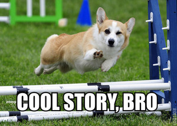
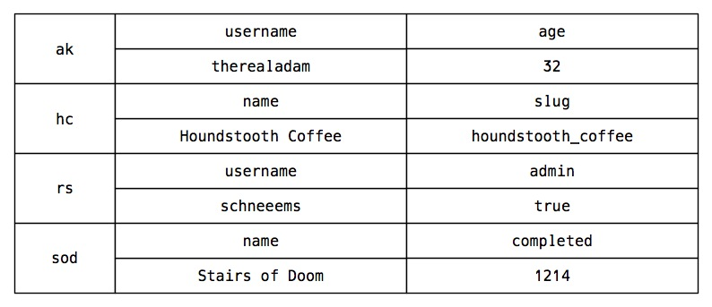
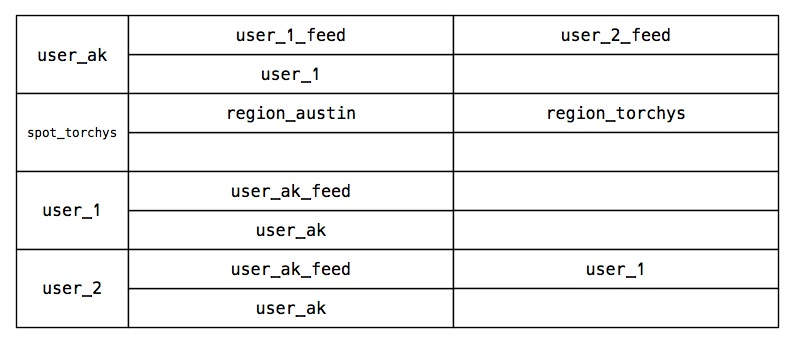
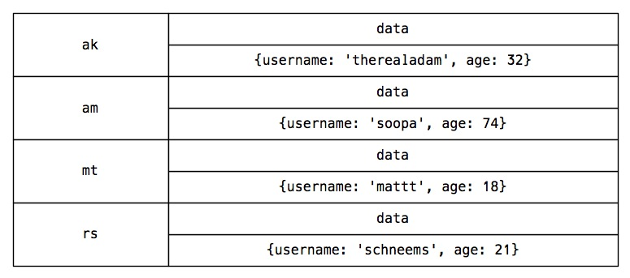
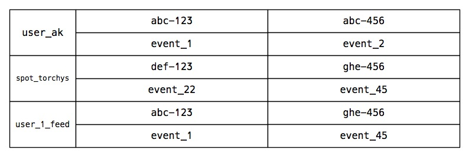

<!SLIDE center>
# Chronologic
## A service for storing event data, related objects, social graphs, and assembling it into activity feeds.

<!SLIDE center>

<!SLIDE center bullets incremental>
# Events and object references
- People generate events (statuses, checkins, photos, TPS reports, etc.)
- Events refer to other objects (users, locations, photos, documents,
  etc.)

<!SLIDE center bullets incremental>
# Social graphs
- People connect with other people (follow, friend, manage, report to,
  etc.)
- People want to know what other people are up to (status feed, checkin
  feed, photo feed, etc.)

<!SLIDE center bullets incremental>
# Applications replicate objects/social graph

- Applications "record" referred objects (users, spots, etc.)
- Applications "subscribe" timelines to other timelines (follow, friend,
  etc.)

<!SLIDE center bullets incremental>
# Applications publish events

- Applications "publish" events to timelines (checkin -> user, spot)
- Chronologic saves the events and writes them to all the timelines that
  subscribe to that timeline 

<!SLIDE center bullets incremental>
# Applications consume feeds
- Applications "fetch" a timeline and get back a fully-materialized list
  of events, subevents, and objects that in one request
- Chronologic does this by replicating objects that are referred to by
  events and doing a fan-out write of all events to the relevant timelines

<!SLIDE center bullets incremental>
# Chronologic is a service...

- Applications talk to a REST/JSON API
- Chronologic app is implemented in Sinatra
- Chronologic talks to a Cassandra cluster via Thrift

<!SLIDE full-page center>

<!SLIDE center>
# Internals

<!SLIDE center bullets>

- `Objects` stores replicated data as key/blob pairs, though this may
  change to leverage secondary indexes

<!SLIDE center bullets full-page>

<!SLIDE center bullets>
- `Subscriptions` maps timelines that are consumed as feeds to timelines
  that are written to by events. It also includes a backlink to do basic
  privacy checks. The storage structure maps subscriber keys to consumer
  timeline/user key pairs.

<!SLIDE center bullets full-page>

<!SLIDE center bullets>

- `Events` stores all events as key/column structures. Each event stores
  blobs for event attributes, timelines, and referenced objects. A
  timestamp is also stored and used to generate index keys.

<!SLIDE center bullets full-page>

<!SLIDE center bullets>
- `Timelines` are indexes that map a feed to a series of events. Each
  key represents one timeline; the column name/value pairs map sortable
  timestamps (as stored in the event) to a key into the `Events` CF.

<!SLIDE center bullets full-page>

<!SLIDE center bullets incremental>
# Internals

- When an event is published, it is immediately stored in `Events`. Each
  timeline it specifies is then updated with an index entry pointing to
  the new event. Any subscribers to the updated timelines are then
  themselves updated.
- When a timeline is requested, a batch of columns are fetched from
  `Timelines` and then each event referenced by those columns is fetched
  from `Event`.

<!SLIDE center bullets incremental>
# Internals
- Events sometimes have subevents (e.g. a comment on a checkin). In this
  case, `Timelines` is read again to find events on the timeline for the
  event with subevents.

<!SLIDE full-page center>

<!SLIDE center bullets incremental>
# Object API

- `record`: `POST /objects`
- `unrecord`: `DELETE /objects`

<!SLIDE center bullets incremental>
# Social graph API

- `subscribe`: `POST /subscriptions`
- `unsubscribe`: `DELETE /subscriptions`

<!SLIDE center bullets incremental>
# Event API
- `publish`: `POST /events`
- `unpublish`: `DELETE /events`

<!SLIDE center bullets incremental>
# Feed API
- `fetch`: 'GET /timelines'

