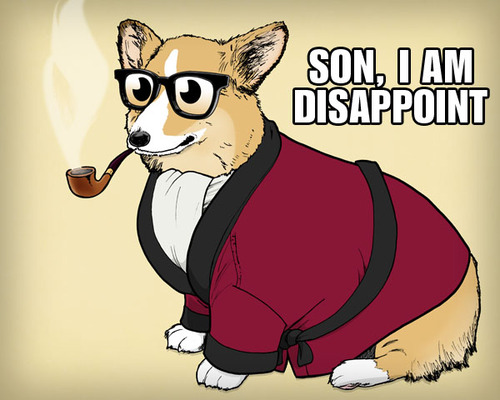
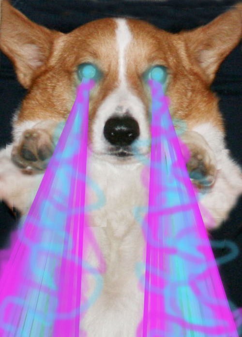

<!SLIDE center>

# Hello, Chronologic

<!SLIDE code>

    @@@ ruby
    connection = Chronologic::Client::Connection.new(
      'http://localhost:9292'
    )

<!SLIDE code>

    @@@ ruby
    event = Chronologic::Event.new
    event.key = "story_1"
    event.timestamp = Time.now.utc
    event.data = {
      "headline" => "First ever post in Chronologic!",
      "lede" => "A monumental occasion for housecats everywhere.",
      "body" => "There is currently a cat perched on my arm. This is normal, carry on!"
    }
    event.timelines = ['home']

    connection.publish(event)

<!SLIDE code>

    @@@ ruby
    feed = connection.timeline('home')

    puts "We found #{feed['count']} events."
    puts "That event looks just like this:"
    pp feed['items'].first

<!SLIDE code>

    We found 1 events.
    That event looks just like this:
    {"data"=>
      {"body"=>
        "There is currently a cat perched on my arm. This is normal, carry on!",
       "headline"=>"First ever post in Chronologic!",
       "lede"=>"A monumental occasion for housecats everywhere."},
     "timestamp"=>"Sat Aug 13 15:57:21 UTC 2011",
     "subevents"=>[],
     "key"=>"story_1",
     "objects"=>{},
     "timelines"=>["home"]}

<!SLIDE center>

<!SLIDE full-page center>

<!SLIDE center>
# Event fanout

<!SLIDE code>

    @@@ ruby
    connection.subscribe("tech", "home")

<!SLIDE code>

    @@@ ruby
    event = Chronologic::Event.new
    event.key = "story_1"
    event.timestamp = Time.now.utc
    event.data = {
      "headline" => "First ever post in Chronologic!",
      "lede" => "A monumental occasion for housecats everywhere.",
      "body" => "There is currently a cat perched on my arm. This is normal, carry on!"
    }
    event.timelines = ["tech"]

<!SLIDE code>

    @@@ ruby
    connection.publish(event)

    feed = connection.timeline("home")

    pp feed['items'].first

<!SLIDE code>

    {"data"=>
      {"body"=>
        "There is currently a cat perched on my arm. This is normal, carry on!",
       "headline"=>"First ever post in Chronologic!",
       "lede"=>"A monumental occasion for housecats everywhere."},
     "timestamp"=>"Sat Aug 13 15:58:29 UTC 2011",
     "subevents"=>[],
     "key"=>"story_1",
     "objects"=>{},
     "timelines"=>["tech"]}

<!SLIDE center>

# Events beget subevents

<!SLIDE code>

    @@@ ruby
    event = Chronologic::Event.new
    event.key = "story_1"
    event.timestamp = Time.now
    event.data = {
      "headline" => "First ever post in Chronologic!",
      "lede" => "A monumental occasion for housecats everywhere.",
      "body" => "There is currently a cat perched on my arm. This is normal, carry on!"
    }
    event.timelines = ["home"]

    connection.publish(event)

<!SLIDE code>

    @@@ ruby
    subevent = Chronologic::Event.new
    subevent.key = "comment_1"
    subevent.timestamp = Time.now
    subevent.data = {
      "message" => "LOL cats!"
    }
    subevent.parent = "story_1"
    subevent.timelines = ["story_1"]

    connection.publish(subevent)

<!SLIDE code>

    @@@ ruby
    feed = connection.timeline("home")

    pp feed['items'].first

<!SLIDE code>

    {"data"=>
      {"body"=>
        "There is currently a cat perched on my arm. This is normal, carry on!",
       "headline"=>"First ever post in Chronologic!",
       "lede"=>"A monumental occasion for housecats everywhere."},
     "timestamp"=>"Sat Aug 13 16:00:17 UTC 2011",
     "subevents"=>
      [{"data"=>{"parent"=>"story_1", "message"=>"LOL cats!"},
        "timestamp"=>"Sat Aug 13 16:00:17 UTC 2011",
        "subevents"=>[],
        "timelines"=>["story_1"],
        "objects"=>{},
        "key"=>"comment_1"}],
     "key"=>"story_1",
     "objects"=>{},
     "timelines"=>["home"]}

<!SLIDE center>
# Events reference objects

<!SLIDE code>

    @@@ ruby
    connection.record(
      "author_1", 
      {"name" => "Adam"}
    )
    connection.record(
      "author_2", 
      {"name" => "Fred Derp"}
    )

<!SLIDE code>

    @@@ ruby
    event = Chronologic::Event.new
    event.key = "story_1"
    event.timestamp = Time.now
    event.data = {
      "headline" => "First ever post in Chronologic!",
      "lede" => "A monumental occasion for housecats everywhere.",
      "body" => "There is currently a cat perched on my arm. This is normal, carry on!"
    }
    event.objects = {"author" => ["author_1"]}
    event.timelines = ["home"]

    connection.publish(event)

<!SLIDE code>

    @@@ ruby
    subevent = Chronologic::Event.new
    subevent.key = "comment_1"
    subevent.timestamp = Time.now
    subevent.data = {
      "message" => "LOL cats!"
    }
    subevent.parent = "story_1"
    subevent.objects = {"author" => ["author_2"]}
    subevent.timelines = ["story_1"]

    connection.publish(subevent)

<!SLIDE code>

    @@@ ruby
    feed = connection.timeline("home")

    pp feed['items'].first

<!SLIDE code>

    {"data"=>
      {"body"=>
        "There is currently a cat perched on my arm. This is normal, carry on!",
       "headline"=>"First ever post in Chronologic!",
       "lede"=>"A monumental occasion for housecats everywhere."},
     "timestamp"=>"Sat Aug 13 16:01:48 UTC 2011",
     "subevents"=>
      [{"data"=>{"parent"=>"story_1", "message"=>"LOL cats!"},
        "timestamp"=>"Sat Aug 13 16:01:48 UTC 2011",
        "subevents"=>[],
        "timelines"=>["story_1"],
        "objects"=>{"author"=>[{"name"=>"Fred Derp"}]},
        "key"=>"comment_1"}],
     "key"=>"story_1",
     "timelines"=>["home"],
     "objects"=>{"author"=>[{"name"=>"Adam"}]}}

<!SLIDE center>

# A familiar social application

<!SLIDE code>

    @@@ ruby
    connection.record(
      "user:ak", 
      {"long_name" => "Adam Keys"}
    )
    connection.record(
      "user:rs", 
      {"long_name" => "Richard Schneeman"}
    )
    connection.record(
      "user:mt", 
      {"long_name" => "Mattt Thompson"}
    )
    connection.record(
      "user:am", 
      {"long_name" => "Adam Michaela"}
    )

    connection.record(
      "spot:lsrc", 
      {"name" => "Lone Star Ruby Conference"}
    )

<!SLIDE code>

    @@@ ruby
    connection.subscribe(
      "passport:ak", 
      "friends:rs"
    )
    connection.subscribe(
      "passport:ak", 
      "friends:am"
     )
    connection.subscribe(
      "passport:ak", 
      "friends:mt"
    )

<!SLIDE code>

    @@@ ruby
    event = Chronologic::Event.new
    event.key = "checkin:1"
    event.timestamp = Time.now
    event.data = {"message" => "I'm giving a talk!"}
    event.objects = {
      "user" => ["user:ak"], 
      "spots" => ["spot:lsrc"]
    }
    event.timelines = ["passport:ak"]

    connection.publish(event)

<!SLIDE code>

    @@@ ruby
    subevent = Chronologic::Event.new
    subevent.key = "comment:1"
    subevent.timestamp = Time.now
    subevent.data = {"message" => "Me too!"}
    subevent.parent = "checkin:1"
    subevent.objects = {"user" => ["user:rs"]}
    subevent.timelines = ["checkin:1"]

    connection.publish(subevent)

<!SLIDE code>

    @@@ ruby
    feed = connection.timeline("friends:rs")
    pp feed

    # Identical data
    connection.timeline("friends:am")
    connection.timeline("friends:mt")

<!SLIDE code>

    {"items"=>
      [{"data"=>{"message"=>"I'm giving a talk!"},
        "timestamp"=>"Sat Aug 13 16:05:02 UTC 2011",
        "subevents"=>
         [{"data"=>{"parent"=>"checkin:1", "message"=>"Me too!"},
           "timestamp"=>"Sat Aug 13 16:05:02 UTC 2011",
           "subevents"=>[],
           "timelines"=>["checkin:1"],
           "objects"=>{"user"=>[{"long_name"=>"Richard Schneeman"}]},
           "key"=>"comment:1"}],
        "key"=>"checkin:1",
        "objects"=>
         {"spots"=>[{"name"=>"Lone Star Ruby Conference"}],
          "user"=>[{"long_name"=>"Adam Keys"}]},
        "timelines"=>["passport:ak"]}],
     "next_page"=>"00000000-0000-0000-0004-aa6531470780",
     "count"=>1}

<!SLIDE full-page center>

